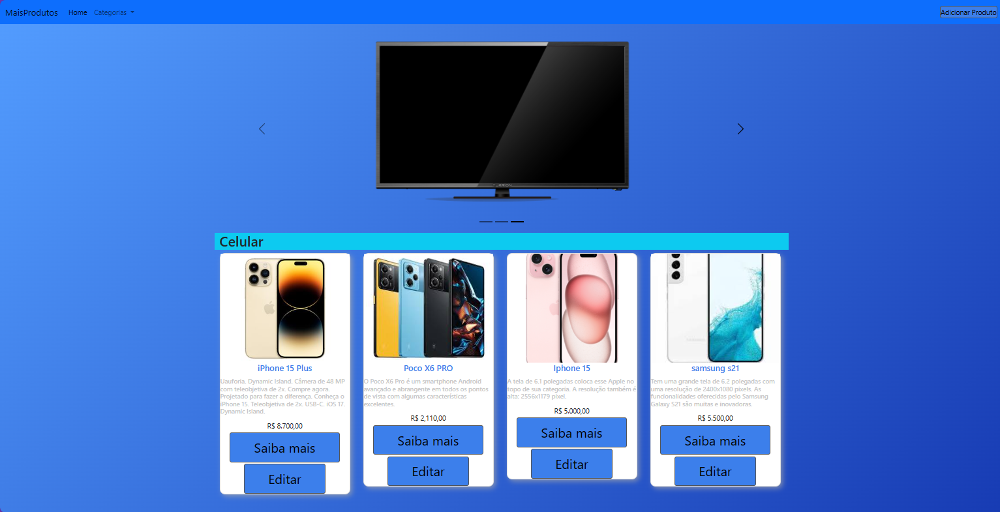
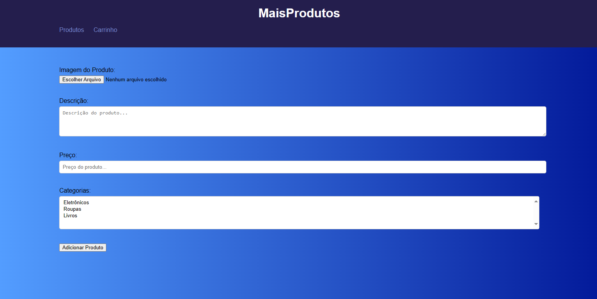
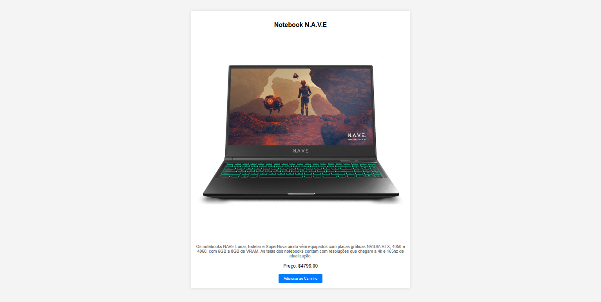
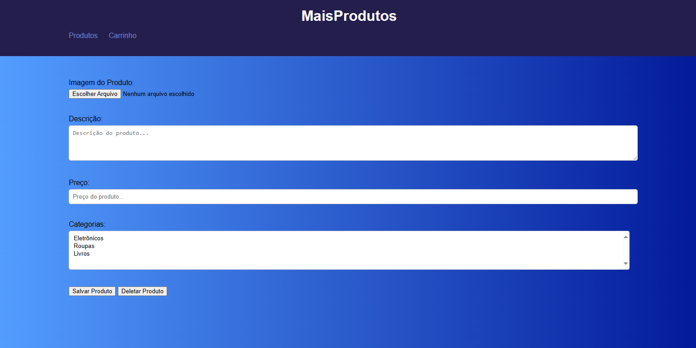

# MAIS_PRODUTOS_FRONTEND

UNIMAR - UNIVERSIDADE DE MARÍLIA
CURSO: ANÁLISE E DESENVOLVIMENTO DE SISTEMAS
TERMO:3B

#BRENDA DE OLIVEIRA TERUER - 1978541
#JEFFERSON PEREIRA VIEIRA - 1962772
#KAUE RUSSO SIMOES - 1973270
#LUCCA MORENO - 1965412

NOME DO PROJETO: MAIS PRODUTOS

DESCRIÇÃO DO PROJETO: O NOSSO PROJETO SE TRATA DA GESTÃO INTERNA DE UM SITE DE E-COMMERCE. NELE HÁ AS TELAS: LOGIN, CADASTRAR OS PRODUTOS, EDITAR PRODUTOS, TELA DE DETALHES DOS PRODUTOS E A TELA PRINCIPAL ONDE HÁ A LISTAGEM DOS PRODUTOS E DE ONDE É POSSÍVEL ACESSAR AS DEMAIS TELAS.

TELA DE LOGIN:

(Tela onde é possível efetuar o login para entrar na tela de compra e venda de produtos, com a validação em JavaScript onde tem obrigatoriamente que preencher os campos)

TELA PRINCIPAL - TELA DE LISTAGEM DE PRODUTOS:

(Tela onde é possível visualizar os produtos já cadastrados. Também é possível ter acesso ás telas de Edição de produtos, Tela de detalhes dos produtos e Tela de adicionar produtos. Conta com o carrossel mostrando a vitrine de produtos, menu de categorias)

TELA DE ADICIONAR PRODUTOS:

(Tela onde é possível cadastrar novos produtos, conta com a validação de preenchimento dos campos em JavaScript)

TELA DE DETALHES DE PRODUTOS:

(Tela onde é possível ver os detalhes dos produtos ao serem clicados, conta com a presença do botão de adicionar ao carrinho, onde após adicionado, volta para a tela principal)

TELA DE EDITAR PRODUTOS:

(Tela onde é possível fazer a edição das informações dos produtos após eles terem sido criados. Também é possível fazer a exclusão do produto)

